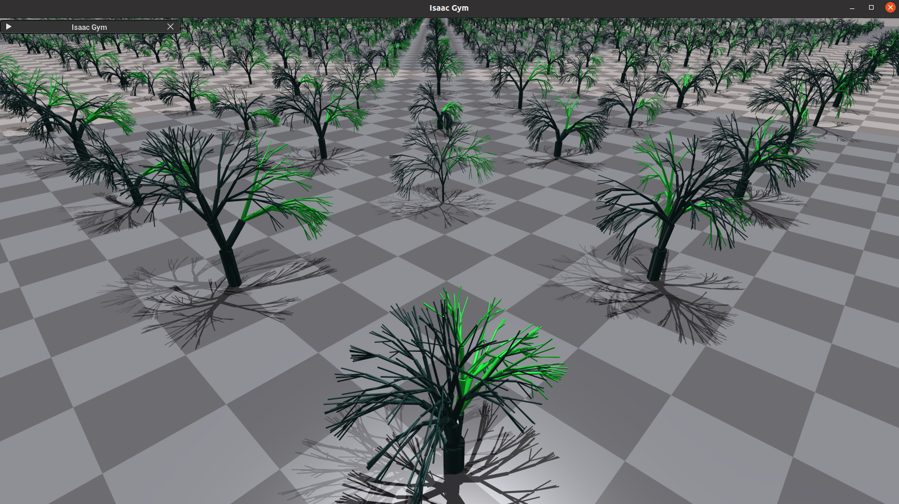
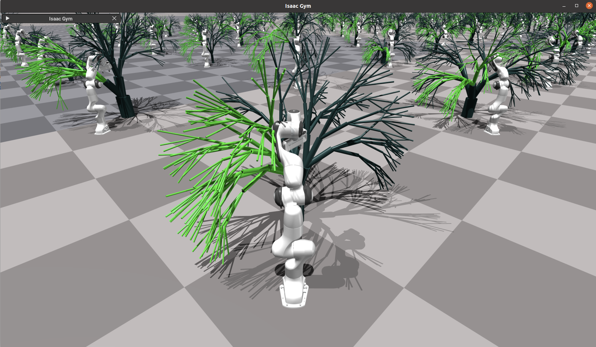

## Gentle Manipulation of Tree Branches: A Contact-Aware Policy Learning Approach

A toolkit for massively parallel procedural generation of deformable forests and Proprioceptive Contact-Aware Policy Learning (PCAP) for gentle, contact-aware robotic manipulation of tree branches.

Code implementation for the paper: Gentle Manipulation of Tree Branches: A Contact-Aware Policy Learning Approach: 
https://sites.google.com/view/pcap




### Pre requisites

1. Ubuntu 18.04 or 20.04
2. Python 3.8
3. Nvidia Graphics Card to run Isaac Gym
4. Separate Conda or Venv


### Installations

#### Isaac Packages
1. Install Pytorch
2. Download & Install Isaac Gym (simulator): https://docs.robotsfan.com/isaacgym/install.html
3. Clone & Install Isaac Gym Envs (RL): https://github.com/isaac-sim/IsaacGymEnvs
4. Set spot_path environment variable e.g.,
    ```bash
    export spot_path="/home/<path>/<to>/pcap"
    export isaacgymenvs_path="/home/<path>/IsaacGymEnvs/isaacgymenvs"
    ```
5. Test basic RL examples (with UI) as described in the Isaac Gym Envs documentation 
    ```bash
    python train.py task=Ant
    ```
6. Install required libraries (refer versions inside requirements.txt)

### Notebooks

To run notebooks first set spot_path in command line and then 

```bash
cd "$spot_path/notebooks"
jupyter-lab
```

### IDE

   ```
      > Note: Set the "$spot_path/source" folder as source to run directly in IDE.       
      > E.g. In Pycharm Settings >> Project Structure >> Source Folders >> add $spot_path/source
   ```

### Execution

1. Forest Generator: Generates URDF files for rigid body tree structure based on configuration file
    Choose ```lsystems1``` for Single axis rotation and  ```lsystems2``` for fully deformable branches.
    ```bash
        Config: $spot_path/source/simulation/lsystems2/three/conf/{tree}.yaml
        Generate Basic LSystem File : python $spot_path/source/simulation/lsystems2/three/assemblers/pipeline_runner.py
        Target: $spot_path/source/simulation/lsystems2/three/urdf/.../<raw_train or raw_test>/
    ```
2. For each tree find out the degree of rotation so that the flexible dof-links and the robot is the closest. Only required if you are generating custome trees
    
    ```bash
        python source/reinforcement/tactile/tree_base_rotation_calculator.py
        Source: $spot_path/source/simulation/lsystems2/three/urdf/.../<raw_train or raw_test>/
        Target: $spot_path/source/simulation/lsystems2/three/urdf/.../<train or test>/
    ```
3. Forest Visualiser
   ```bash
        "$spot_path/notebooks/work2/isaacgym/lsystems - 01 - forest - visualiser - isaac gym.ipynb"
   ```
4. Training the contact classifier. Capture the dataset with physical interactions and run
    ```bash
   $spot_path/notebooks/work2/kinova/kinova collison classifier- 1c - build dataset n classify - velocity.ipynb
   ```
5. Add the entries in local Isaac Gym Envs to run the gym RL tasks
   ```bash
   E.g. in "<local>/IsaacGymEnvs/isaacgymenvs/tasks/__init__.py" add the entries for the run tasks:
   from .sim2_real_kinova_tree_tactile_voxel_reach import Sim2RealKinovaTreeTactileVoxelReach
   "Sim2RealKinovaTreeTactileVoxelReach": Sim2RealKinovaTreeTactileVoxelReach, 

   ```
6. Reinforcement Learning (using isaacgymenvs/rl_games package). Set the path & run the shell script as below
   ```bash
    export isaacgymenvs_path="<path>/<to>/IsaacGymEnvs/isaacgymenvs"
    # Train
    bash $spot_path/source/reinforcement/ige/ige_task_runner.sh task=Sim2RealKinovaTreeTactileVoxelReach num_envs=8192 headless=True 
    # Simulation Test
    bash $spot_path/source/reinforcement/ige/ige_task_runner.sh task=Sim2RealKinovaTreeTactileVoxelReach test=True num_envs=1  checkpoint=runs/<trained_checkpoint>/nn/Sim2RealKinovaTreeTactileVoxelReach.pth
    # Real Test
    bash $spot_path/source/reinforcement/ige/ige_task_runner.sh task=Sim2RealKinovaTreeTactileVoxelReach test=True +real=True num_envs=1  checkpoint=runs/<trained_checkpoint>/nn/Sim2RealKinovaTreeTactileVoxelReach.pth
   ```

### Real Executions ROS & API

During sim-to-real transfer, we stand up an external web service (running on a machine connected to the robot) that operates Kinova-ROS and interfaces with the RL pipeline

Ensure ROS-1 (for Kinova Jaco2) is installed as described in
https://github.com/Kinovarobotics/kinova-ros

Modules that will end up being part of external builds. For e.g. part of kinova-ros package to run Jaco arm.

   ```
     Note: Requires additional path settings in IDE to be interpretable
     In Pycharm Settings >> Project Structure >> Source Folders >> 
        1. Add local ROS libraries as content root : E.g., "/opt/ros/noetic/share:
        2. Add kinova_msgs as content root from local installation of kinova_ros: E.g., "catkin_ws/src/kinova-ros/kinova-msgs"
   ```

  To run,
  
   ```bash
    export spot_path="/home/<path>/<to>/pcap"
    export kinova_ros_path="/home/<path>/<to>/catkin_ws/src/kinova-ros"
    bash $spot_path/external/kinova_spot_installer.sh
    
    cd "${kinova_ros_path}/../../"
    # in different terminals
    roslaunch kinova_bringup kinova_robot.launch kinova_robotType:=j2n6s300
    rosrun spot_control gt_trajectory_tree_pos_control.py -v -r j2n6s300 0
   
   ```


### Real Hardware API (to connect to Jaco)

   ```
   rosrun spot_control tactile_rl_txn_control.py j2n6s300 0
   ```
   Service Commands are listed below. To test, on firing the below fetch_kinova_metrics URL in browser, you should get the current kinova dof pos, vel, EE metrics etc as a json.
   
   http://ip:3738/fetch_kinova_metrics   
   http://ip:3738/shutdown   
   http://ip:3738/set_dof_pos   


### Citation

```
@inproceedings{jacob2025gentle,
  title={Gentle Manipulation of Tree Branches: A Contact-Aware Policy Learning Approach},
  author={Jacob, Jay and Cai, Shizhe and Borges, Paulo Vinicius Koerich and Bandyopadhyay, Tirthankar and Ramos, Fabio},
  booktitle={Conference on Robot Learning},
  pages={631--648},
  year={2025},
  organization={PMLR}
}
```

### Copyrights

While most work in this repository is original, some are taken/inspired from external github sources.

https://github.com/MFreidank/pysgmcmc/tree/pytorch     
https://github.com/EugenHotaj/pytorch-generative/blob/master/pytorch_generative/models/kde.py       
https://github.com/ThomasLENNE/L-system        
https://github.com/NVIDIA-Omniverse/IsaacGymEnvs       
https://github.com/facebookresearch/pytorch3d/tree/main       
https://github.com/NVlabs/storm/tree/main       
https://github.com/facebookresearch/differentiable-robot-model   


⚠️ **Note:** This repository is **not actively maintained**, but **pull requests are welcome**.
